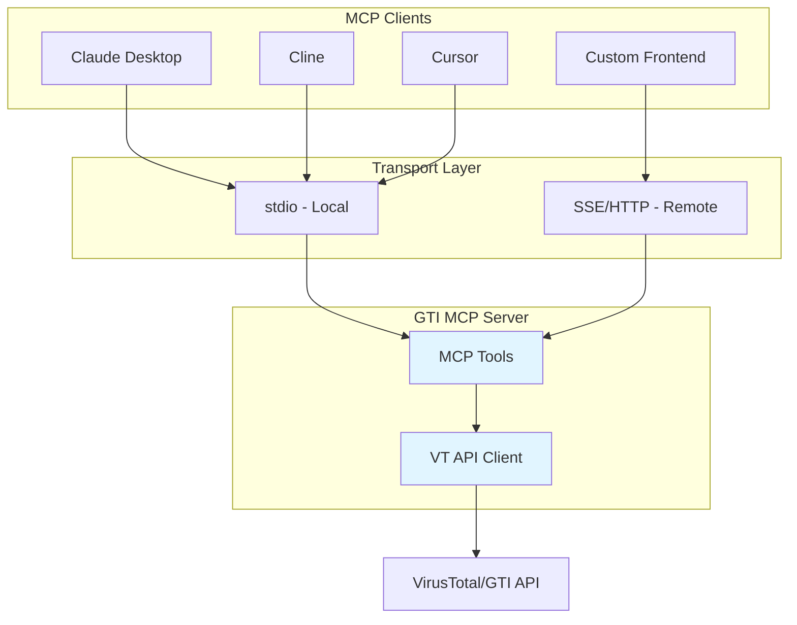
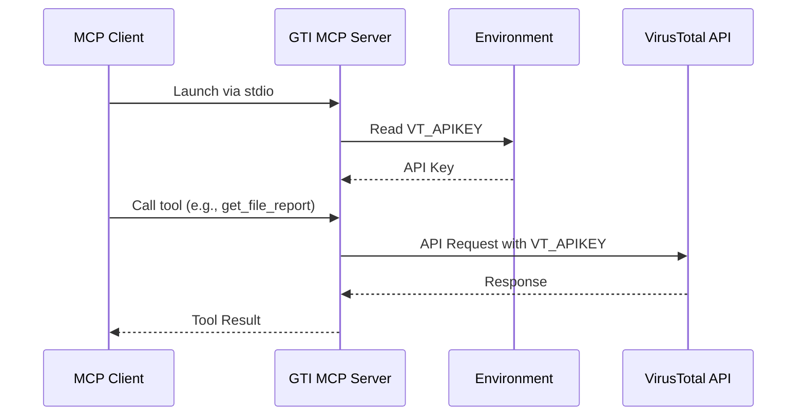
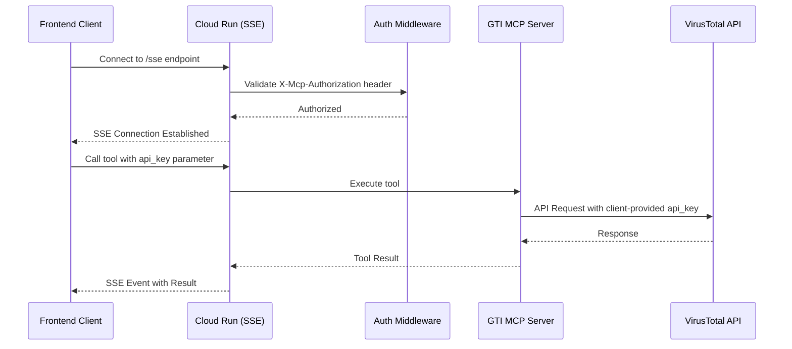

# GTI MCP Server Architecture Diagrams

This document contains Mermaid diagrams for the GTI MCP Server architecture.

## Component Overview Diagram

## Local Deployment Flow Diagram

## Cloud Deployment Flow Diagram

